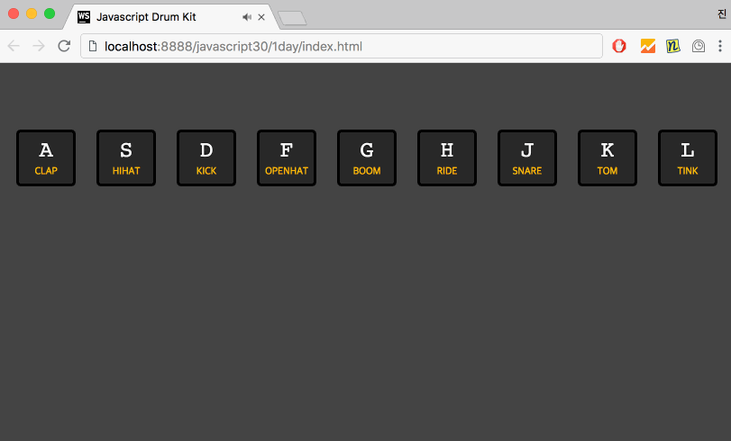

## #Javascript30 1day
### Javascript Drum Kit

**프로그램 조건**
1. 키보드를 누르면 해당하는 사운드 재생
2. 키보드를 누르면 키 애니메이션효과(키가 살짝 확대되고, 노란테두리 생김)

**개발 방법**
1. div(키보드)와 audio(사운드)가 동일한 `data-key:{{keycode}}`값을 가져서 이것으로 제어
2. keydown, keyup 이벤트를 사용하여 클래스를 추가 -> 애니메이션효과 (transition을 이용하여 애니메이션효과)

* 참고
* http://keycode.info/ - keycode값을 바로 알수있는 사이트
