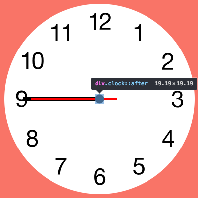
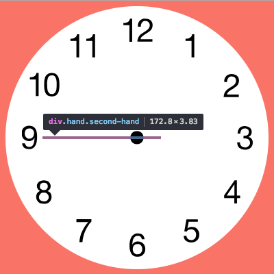
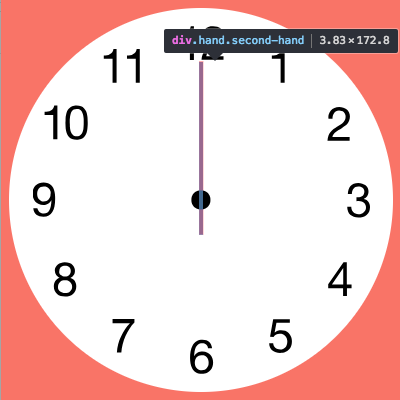
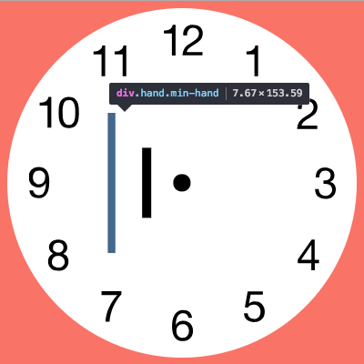
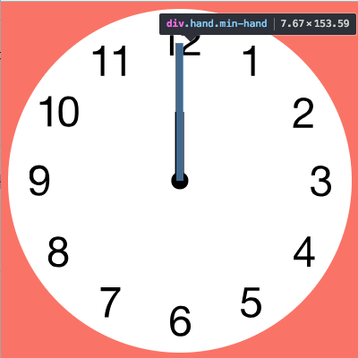

## #Javascript30 2-day
### CSS + JS Clock

**프로그램 조건**

1. 아날로그 시계 UI 구현

---

**관련 기술**

1. [transform](#transform)
2. [transform-origin](#transform-origin)
3. [transition](#transition)
4. [transition-timing-function](#transition-timing-function)

#### transform
- 이동(translate), 회전(rotate), 크기변경(scale), 기울임(skew)등의 효과를 주는 요소.

* 시계 가운데 기준점 **이동(translate)**.
```css
 transform: translate(-50%, -50%);
```
| 적용 전 | 적용 후 |
| ------- | -----|
|  |  |

* 시계바늘을 00:00:00이 기본이 되도록 **회전(rotate)**.
```css
 transform: rotate(90deg);
```
| 적용 전 | 적용 후 |
| ------- | -----|
|  |  |


#### transform-origin
- 변형, 회전 등의 기준이 되는 기준점.  length, %, keyword로 값 지정.

| Keyword | Value |
| ------- | -----|
| `left` | 0% |
| `center` | 50% |
| `right` | 100% |
| `top` | 0% |
| `bottom` | 100% |

```css
 transform-origin: x-offset y-offset z-offset|initial|inherit;

 /* default */
 transform-origin: 50% 50%;
```
* 시계바늘의 회전 축을 가운데로 변경.
```css
 transform: rotate(90deg);
 transform-origin: 100%;
```
| 적용 전 | 적용 후 |
| ------- | -----|
|  |  |

#### transition
- CSS 속성을 변경할 때 애니메이션 속도를 조절함.

```css
transition: [transition-property] [transition-duration] [transition-timing-function] [transition-delay]
```

* 변하는 속성 전부에 1s 지연시간을 줌.

<iframe height='306' scrolling='no' title='oPevGo' src='https://codepen.io/jinyowo/embed/oPevGo/?height=306&theme-id=dark&default-tab=css,result&embed-version=2' frameborder='no' allowtransparency='true' allowfullscreen='true' style='width: 100%;'>See the Pen <a href='https://codepen.io/jinyowo/pen/oPevGo/'>oPevGo</a> by Heo Jin (<a href='https://codepen.io/jinyowo'>@jinyowo</a>) on <a href='https://codepen.io'>CodePen</a>.
</iframe>

#### transition-timing-function
- 속성의 중간값을 계산하는 방법을 정의하는 함수를 명시. cubic-bezier를 정의하는 네 점으로 명시


**<출처>**
https://developer.moilla.org/en-US/docs/Web/CSS/transform-origin
https://developer.mozilla.org/en-US/docs/Web/CSS/transform
https://developer.mozilla.org/ko/docs/Web/CSS/CSS_Transitions/Using_CSS_transitions